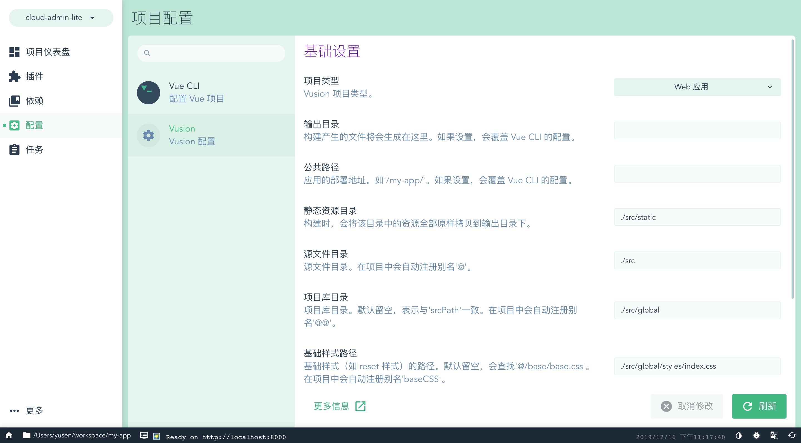

# vue-cli-plugin-kubevue

Vue CLI Plugin for Kubevue Projects



## Kubevue Config

``` js
{
    type: '', // Kubevue project type, such as: 'app', 'library', 'component', 'block', 'repository'
    outputPath: '', // If set, the `outputDir` property of vue.config.js
    publicPath: '', // If set, the `publicPath` property of vue.config.js
    staticPath: '', // Static resource directory. When building, all resources in this directory will be copied to the output directory as they are.
    srcPath: './src', // Source file directory. The alias '@' is automatically registered in the project.
    libraryPath: '', // Project library directory. Leave blank by default, indicating consistency with 'srcPath'. The alias '@@' is automatically registered in the project.
    baseCSSPath: '', // The path of the base style (such as reset style). If left blank by default, '@/base/base.css' will be searched. The alias 'baseCSS' is automatically registered in the project.
    theme: undefined, // Select a theme. The path where the theme CSS is located, and the theme name is the CSS name. Can also be an object.
    applyTheme: false, // Apply the theme and inject theme variables into CSS. If you need to be compatible with IE browser, it must be turned on.
    docs: false, // Document configuration
    docStaticURL: '', // Document static resource URL, the default is https://static-kubevue.s3.amazonaws.com
    alias: { // Used to set Webpack alias
        '@': path.resolve(__dirname, 'src'),
        ...
    },
};
```

## Commands

### 全局

- 增加了 alias
- 增加了 vue-multifile-loader
- 对 CSS 做了处理

### library-build

专门针对库进行构建。

#### --theme

设置主题。

#### --kubevue-mode raw

原生模式，一般在打包组件库时使用，不处理 babel、icon-font、css-sprite。

#### --base-css

设置 Base CSS 的路径。

#### --cache

缓存库的打包。

#### --output-path

覆盖默认的 output.path。

#### --public-path

覆盖默认的 publicPath。

#### --src-path

覆盖默认的 srcPath。

#### --library-path

覆盖默认的 libraryPath。

### doc

开发文档，启动文档的 dev 服务。

### doc-build

构建文档。

## Generator

没有 Generator，请使用 [kubevue init](https://github.com/kubevue/kubevue)

## UI

增加了 Kubevue Config 的配置界面。

## Changelog

See [Releases](https://github.com/kubevue/vue-cli-plugin-kubevue/releases)

## Contributing

See [Contributing Guide](https://github.com/kubevue/DOCUMENTATION/issues/8)

## License

[MIT](LICENSE)
